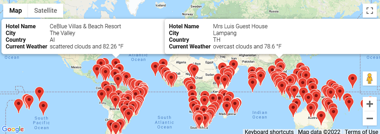
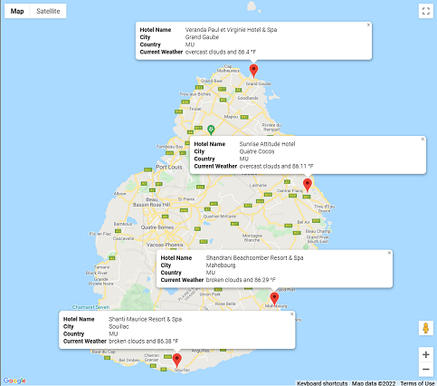
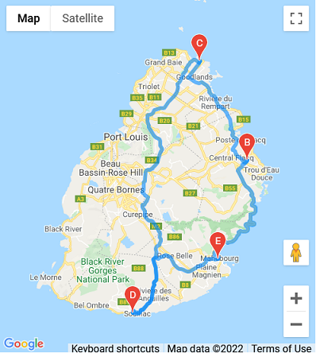

# **Working with OpenWeatherMap and Google Maps API's**

## **Overview of Project**
The main focus of this project is to interact with and retrieve data from
weather and mapping API's. Understanding the format of the data and how to
select the data was the primary task. The context for the project is the
creation of a travel app that would be able to take in user preferences for
minimum and maximum temperatures of possible vacation destinations. The app
would then be able to filter out destinations that don't meet the criteria and
suggest a possible itinerary of four cities with driving directions and nearby
hotels.

## **Analysis**
### **City and Weather Data for Cities Around the Globe**
The *random* library was used to produce random latitude and longitude pairs in
order to cover a decent amount of the globe. The *citypy* module was then used
to find the nearest cities to the supplied coordinates. From here, weather and
city data was collected from the OpenWeatherMap API for these cities.

### **Acceptable Vacation Destinations Map based on Weather**
To create a map of possible vacation destinations, two input statements
gathering the user's temperature preferences for their vacation were used as
filtering parameters to narrow the down the list of cities found in the first
analysis section. Once the list of cities had been filtered, the Google nearby
search API was used to find nearby hotels for each city. A map of all the
acceptable vacation destinations was created with the *gmaps* module. A marker
layer with an info box containing hotel, city, and weather data was added for
each location. The result is shown here:

    

### **Four City Itinerary with Nearby Hotels**
From the acceptable vacation destinations, four nearby cities were chosen for a
possible itinerary that the user might be interested in. Another map was created
with a similar marker layer as before with just these four cities as seen below:

    

### **Four City Itinerary with Directions Layer**
Using the same four cities from the previous section, an additional map of the
same area was created with a directions layer included. This represents a
possible route to follow while on the vacation.

    

